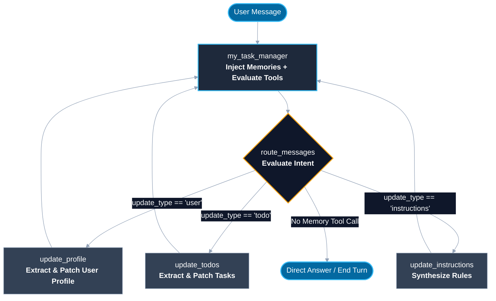

# 🧠 MyTaskManager: Autonomous Long-Term Memory Agent with LangGraph & Trustcall

> A personalized, stateful task companion and memory management agent built with **LangGraph** and **Trustcall**. It automatically captures, organizes, and updates user profile facts, todo tasks, and task-handling instructions across conversation sessions using atomic JSON patches and layered memory stores.

---

## 📑 Table of Contents

* [Overview](https://www.google.com/search?q=%23-overview)
* [Memory Hierarchy & Architecture](https://www.google.com/search?q=%23-memory-hierarchy--architecture)
* [System Graph Flow](https://www.google.com/search?q=%23-system-graph-flow)
* [Key Features](https://www.google.com/search?q=%23-key-features)
* [Repository Structure](https://www.google.com/search?q=%23-repository-structure)
* [Quickstart Guide](https://www.google.com/search?q=%23-quickstart-guide)
* [Usage & Verification](https://www.google.com/search?q=%23-usage--verification)
* [Configuration](https://www.google.com/search?q=%23-configuration)

---

## 🌟 Overview

Standard chat models lose contextual knowledge across multiple conversation threads. **MyTaskManager** addresses this limitation by deploying a dual-memory system:

1. **Short-Term Memory (Within-Thread)**: Powered by LangGraph's `MemorySaver` checkpointer to preserve message runs, active tool execution state, and dialog continuity inside a single thread.
2. **Long-Term Memory (Cross-Thread)**: Powered by LangGraph's namespaced `BaseStore` (e.g., `InMemoryStore`) paired with **Trustcall** schema extractors. It detects user facts, tasks, and interaction guidelines, applying surgical JSON patch updates (`PatchDoc`) to prevent destructive overwriting of historical records.

---

## 🧠 Memory Hierarchy & Architecture

The agent organizes long-term data into three separate namespaces partitioned by `user_id`:

| Memory Category | Namespace Key | Schema Target | Description |
| --- | --- | --- | --- |
| **Profile** | `("profile", user_id)` | `Profile` | Stores biographical details: name, location, occupation, personal connections, and interests. |
| **Tasks / ToDo** | `("todo", user_id)` | `ToDo` | Tracks task description, estimated completion duration, target deadlines, concrete solutions, and status (`not started`, `in progress`, `done`, `archived`). |
| **Instructions** | `("instructions", user_id)` | Markdown string / Dict | Preserves user preferences and rules on how tasks must be structured, categorized, or scheduled. |

---

## 📐 System Graph Flow



---

## ✨ Key Features

* **Surgical JSON Patch Extraction**: Integrates Trustcall's `PatchDoc` engine to perform granular `replace` and `add` operations on existing records instead of generating destructive rewrites.
* **Intent-Driven Routing**: Evaluates incoming human messages and triggers `UpdateMemory` tool calls with distinct classifications (`user`, `todo`, or `instructions`).
* **Dynamic Instruction Self-Evolution**: Automatically updates system guidance when the user expresses format or workflow preferences (e.g., *"Always include specific locations when creating tasks"*).
* **Multi-Turn Graph Re-entry**: Routes memory-update nodes back into `my_task_manager`, allowing the assistant to acknowledge changes and provide answers in a single interaction cycle.

---

## 📂 Repository Structure

```text
MyTaskManager/
├── .env.example              # Environment variables template
├── .gitignore                # Git ignore configuration
├── README.md                 # Project documentation
├── requirements.txt          # Python dependencies
├── main.py                   # Interactive CLI interface
└── src/
    ├── __init__.py           # Python package indicator
    ├── config.py             # LLM setup and model initialization
    ├── schemas.py            # Pydantic data schemas (Profile, ToDo, Memory)
    ├── prompts.py            # System prompts and instructions
    ├── utils.py              # Spy listener and tool call patch extractor
    ├── extractors.py         # Trustcall extractor builders
    └── graph.py              # StateGraph definition and compiled agent

```

---

## 🚀 Quickstart Guide

### 1. Clone the Repository

```bash
git clone https://github.com/SKR18156592/MyTaskManager.git
cd MyTaskManager

```

### 2. Set Up Virtual Environment

```bash
# Create virtual environment
python -m venv venv

# Activate virtual environment
# On macOS / Linux:
source venv/bin/activate
# On Windows:
# venv\Scripts\activate

```

### 3. Install Dependencies

```bash
pip install --upgrade pip
pip install -r requirements.txt

```

### 4. Configure API Keys

```bash
cp .env.example .env

```

Open `.env` and supply your OpenAI key:

```env
OPENAI_API_KEY="your_openai_api_key_here"
OPENAI_MODEL="gpt-4o-mini"

```

### 5. Launch the Assistant

```bash
python main.py

```

---

## 💬 Usage & Verification

During execution, interact with the agent normally or use management commands:

* `/memories` — Inspect current stored records across Profile, ToDo, and Instructions namespaces.
* `/quit` — Exit the active CLI session.

### Example Conversation Flow

```text
============================================================
🤖 MyTaskManager — LangGraph Long-Term Memory Agent
============================================================
Enter user ID (e.g., Suman): Suman
Enter thread/session ID (default: 1): 1

[+] Active Session for: Suman | Thread: 1
Type your message or '/memories' to inspect store, '/quit' to exit.

Suman > My name is Suman. I live in India. I am preparing for AI engineering interviews.
Assistant > Nice to meet you, Suman! I've saved that information to your profile. How can I assist you today?

Suman > When creating tasks, always include specific local recommendations.
Assistant > I've noted that instruction! I'll make sure future tasks include specific local options and recommendations.

Suman > Add a task: Find a gym closer to my home by August.
Assistant > I have added "Find a gym closer to my home" to your ToDo list with a deadline of August 31, 2026.

Suman > /memories

--- [Profile Memory: Suman] ---
{'name': 'Suman', 'location': 'India', 'job': None, 'connections': [], 'interests': ['AI engineering interviews']}

--- [ToDo List: Suman] ---
{'task': 'Find a gym closer to my home', 'time_to_complete': 60, 'deadline': '2026-08-31T00:00:00', 'solutions': ["Gold's Gym", "Anytime Fitness", "Local neighborhood fitness centers"], 'status': 'not started'}

--- [Custom Instructions: Suman] ---
When creating or updating ToDo list items, always include specific local recommendations.
----------------------------------------

```

---

## ⚙️ Configuration

* **Model Backend**: Defaults to `gpt-4o-mini` with `temperature=0` for structured extraction. Configure `OPENAI_MODEL` in `.env` to select alternative chat models.
* **Persistent Storage**: Uses `InMemoryStore` for cross-thread memories and `MemorySaver` for thread state. For production deployments, these can be replaced with persistent storage backends (such as `PostgresStore` or `RedisStore`).